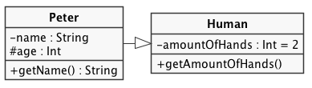

# PlantUML styles

Basic black'n'white styles for use in [PlantUML](http://plantuml.com/).

Include like this:

```
@startuml

!include [relative path to file goes here]

@enduml
```

Naming of files is just my convention of doing it, no need to follow suit.

## Example Class Diagramm
[PlantUML](http://plantuml.com/) supports multiple UML types, class diagramms being one of them.



```
@startuml

!include _uml-styles.iuml

class Peter {
    - name : String
    # age : Int
    + getName() : String
}

class Human {
    - amountOfHands : Int = 2
    + getAmountOfHands()
}

Peter -|> Human

@enduml
```
